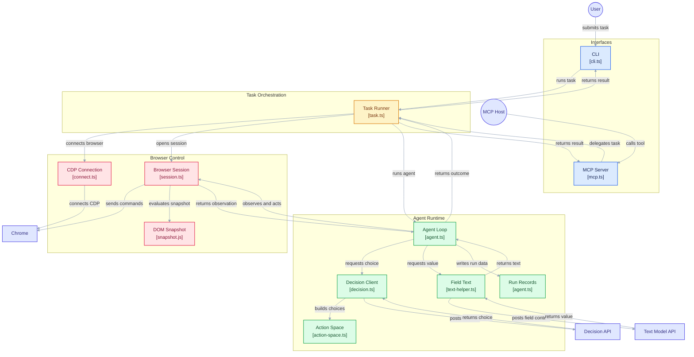

# Prism

Prism 是一个 TypeScript 浏览器智能体 CLI。给它一个网址和一句目标，它会把页面读成一张带编号的可见控件表，让决策模型选择「对哪个元素执行哪个操作」，通过 Chrome
DevTools Protocol 执行，直到决策模型判定目标达成。



## 环境要求

- Node.js >= 22.19
- 可通过 CDP 连接的 Chrome
- `TYPESAFE_API_KEY`
- 一个 OpenAI 兼容的 key

## 安装

Prism 未发布到 npm，从源码构建。包管理器使用 pnpm（仓库锁定 9.15.9，执行
`corepack enable` 可自动匹配）：

```bash
git clone https://github.com/Tulipe1735/Prism.git
cd Prism
pnpm install
pnpm build
```

构建产物在 `dist/`，含两个可执行入口：`prism`（CLI）和 `prism-mcp`（MCP
server）。构建后可直接验证：

```bash
node dist/cli.js --help
```

在仓库根目录执行 `pnpm link --global` 可把 `prism` 和 `prism-mcp` 一并安装到 PATH：

```bash
pnpm link --global
prism --help
```

## 连接 Chrome

请以远程调试模式启动 Chrome。Chrome
136+ 默认 profile 不允许开启远程调试，因此使用独立 profile 并在其中登录一次：

```bash
# macOS
"/Applications/Google Chrome.app/Contents/MacOS/Google Chrome" \
  --remote-debugging-port=9222 --user-data-dir="$HOME/.prism-chrome"

# Linux
google-chrome --remote-debugging-port=9222 --user-data-dir="$HOME/.prism-chrome"

# Windows
"%PROGRAMFILES%\Google\Chrome\Application\chrome.exe" ^
  --remote-debugging-port=9222 --user-data-dir="%USERPROFILE%\.prism-chrome"
```

## 作为 MCP server 使用

`prism-mcp` 是一个 stdio MCP server，只暴露一个任务级工具：

| 工具           | 输入                                       | 返回                                                                                |
| -------------- | ------------------------------------------ | ----------------------------------------------------------------------------------- |
| `browser_task` | `url`、`goal`、`max_steps?`、`record_dir?` | `status`、`reason`、`final_url`、`final_title`、`final_text`、`steps`、`elapsed_ms` |

宿主把整个浏览子任务委托出去；observe/decide/act 循环、新鲜度校验和预算都由 Prism 自己负责。每步进度会以 MCP
progress notification 上报；取消请求会中止运行并关闭标签页。

opencode（`opencode.json`）：

```json
{
  "$schema": "https://opencode.ai/config.json",
  "mcp": {
    "prism": {
      "type": "local",
      "command": ["prism-mcp"]
    }
  }
}
```

`prism-mcp` 需要在 PATH 上（在仓库根目录执行 `pnpm link --global`），或把 `command` 指向
`["node", "/absolute/path/to/prism/dist/mcp.js"]`。其他 MCP 客户端同理。key 和
`PRISM_BROWSER_URL` 从 server 进程的环境变量及其工作目录下的 `.env` 读取。

注意：不要在配置里用 `"environment": { "TYPESAFE_API_KEY": "{env:TYPESAFE_API_KEY}" }`
传未设置的变量——空值会覆盖 `.env` 里的同名 key，导致加载失败。

## Respect

`src/browser/snapshot.js` 来自
[browser-use/jev-ultrafast](https://github.com/browser-use/jev-ultrafast)，以 MIT
License 使用。详见 [THIRD_PARTY_NOTICES.md](THIRD_PARTY_NOTICES.md)。
