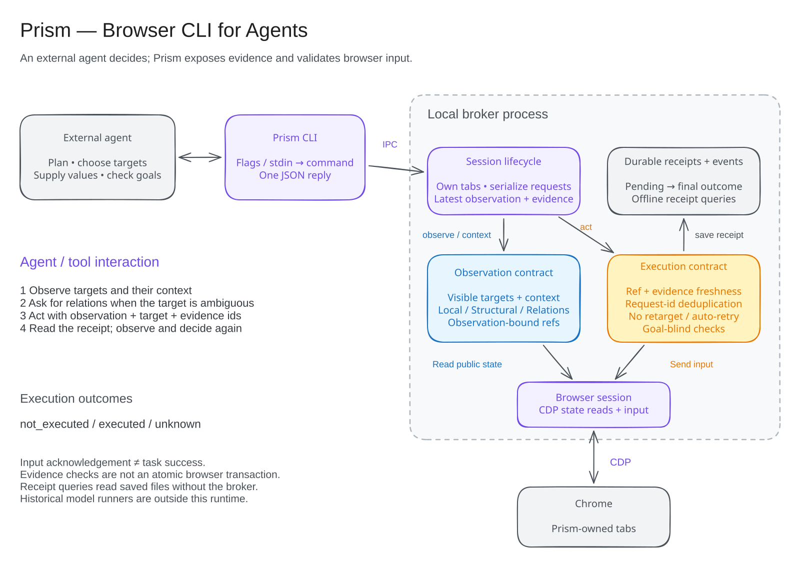

# Prism

[English](README.en.md) | 简体中文

Prism 是供外部 agent 使用的 browser-use
CLI。外部 agent 负责规划、选择目标和判断任务是否完成；Prism 负责观察浏览器、返回目标上下文、校验动作引用和执行单步输入。Prism 不需要模型 API
key，也不会自行调用模型。

## 架构



外部 agent 负责决策；Prism 提供观察与关系证据，检查引用及证据是否仍有效，再执行输入并保存回执。`executed`
表示输入确认，不表示任务成功。

[可编辑 Excalidraw 源图](docs/architecture.excalidraw)

## 先决条件

- Node.js ≥22.19.0
- 可连接远程调试端口的 Chrome。Chrome
  136+ 的默认 profile 不允许远程调试，因此使用独立配置目录：

```bash
google-chrome --remote-debugging-port=9222 --user-data-dir="$HOME/.prism-chrome"
```

## 安装

```bash
npm install -g @tulipe1735/prism
```

也可以使用 `pnpm add -g @tulipe1735/prism`。包提供 `prism` 可执行入口。

## 使用

```bash
prism session open --url https://example.com --browser-url http://127.0.0.1:9222
prism observe --session <session> --scope local
prism context --session <session> --observation <observation> --target <ref> --scope relations
prism act --session <session> --observation <observation> --target <ref> --evidence <evidence> --operation click --request-id decision-1
prism receipt --session <session> --request-id decision-1
prism session close --session <session>
```

尖括号字段必须替换成上一条输出中的真实值。每次 `observe`
返回新的 observation、evidence 与 target refs；旧观察立即失效。`prism <命令> --help`
显示参数与示例。供外部 agent 使用的完整说明在
[skills/prism/SKILL.md](skills/prism/SKILL.md)。

## 从源码运行

贡献者需要 pnpm：

```bash
pnpm install
pnpm build
node dist/cli.js --help
```

`pnpm dev` 直接在源码上运行命令，不生成 `dist/`。
