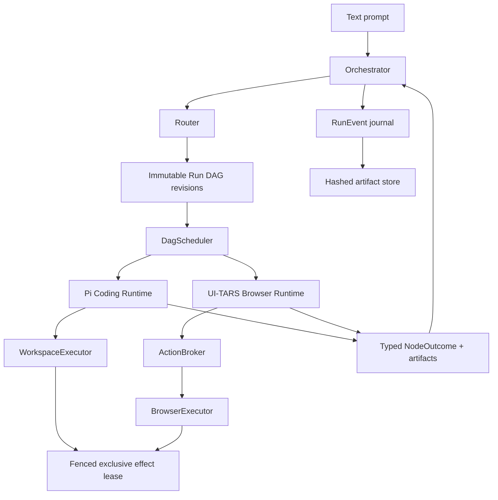
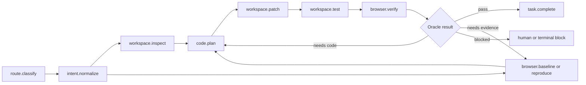

# Prism developer-ready roadmap

Status: `approved`  
Implementation status: `not started`  
Supersedes: the console-operations scenario catalog and I1–I8 graph  

Approving this document approves an architecture and implementation sequence.
It does not create, assign, or begin implementation tickets.

## Destination

Prism is a standalone TypeScript product that accepts a text prompt and
coordinates two embedded sibling runtimes:

- a Pi Agent SDK Coding Runtime that inspects the repository, applies scoped
  source changes through a WorkspaceExecutor, and runs tests;
- a UI-TARS SDK Browser Runtime that reproduces and localizes frontend defects,
  proposes typed actions through an ActionBroker, and verifies the rendered or
  interactive result.

The first release repairs objectively verifiable React interaction, state,
visibility, responsive-layout, occlusion, and directional-style defects. It is
not an open-ended visual designer, third-party dashboard operator, host-agent
plugin, Python or remote-worker platform, or general desktop-control surface.

## System architecture



Only the Orchestrator may append a DAG revision. Runtime prose cannot add
tools, widen authority, or switch runtimes. Read-only work may run in parallel;
source mutations and browser input share one exclusive effect lease.

## Workspace boundary

```text
apps/
  cli/
packages/
  contracts/
  orchestrator/
  runtime-pi/
  runtime-ui-tars/
  workspace-executor/
  action-broker/
  trajectory-store/
  eval/
fixtures/
  react-repair/
```

These pnpm packages modularize Prism; they do not extend a customer's existing
coding agent. Package interfaces remain process-neutral so later isolation
does not require changing DAG or artifact schemas, although the MVP runs in
one Node.js process.

## Canonical contracts

- `RouterDecision`: `coding | browser | hybrid | uncertain`, confidence,
  required capabilities, initial authority, and the initial DAG revision.
- `FrontendRepairSpec`: original prompt plus exact, relational,
  event-to-state, and invariant acceptance predicates.
- `RunDagRevision` and the versioned node registry: typed inputs and outputs,
  runtime, effect class, approval policy, timeout, retry bound, and legal
  successors.
- `RuntimeTaskEnvelope`: run, DAG, node and attempt identity; runtime; artifact
  and baseline references; authority; budget; deadline; cancellation;
  correlation, causation, and idempotency keys.
- `NodeOutcome`: the closed typed outcome vocabulary accepted by the
  Orchestrator.
- `BrowserObservation`: build and page identity, viewport, target, screenshot,
  DOM, accessibility, computed-style, geometry, console, and network evidence.
- `BrowserVerificationReport`: `passed | failed | inconclusive`, assertions,
  evidence references, limitations, and redactions.
- `RunManifest`, `RunEvent`, `ArtifactRef`, and derived `RunSnapshot`.

## Routing and nominal flow

`hybrid` is a capability set, not a fixed sequence. The Router chooses a
starting point from the evidence gap. `uncertain` permits only read-only
evidence until reclassification.



The Orchestrator expands the flow as immutable DAG revisions. Retries append
bounded attempt nodes rather than graph cycles. Workers return artifacts and
typed outcomes; they never mutate the graph. All approved React scenarios
require a pre-mutation baseline or reproduction and final browser verification.

## Persistence, replay, and recovery

The immutable `RunManifest`, append-only sequenced `RunEvent` journal, and
content-addressed artifact store are canonical. `RunSnapshot` is a rebuildable
projection. Runtime-private Pi or UI-TARS checkpoints are optional caches.

After a process restart, Prism restores the last committed node boundary. It
does not continue from partial model output or browser input, undo the prior
node, or rewind the DAG. A read-only node may receive a new bounded attempt.
An unknown effect must be reconciled against workspace or browser reality
before retry. Partial or unknowable effects append a recovery or compensation
node or block for human review. Persisted fencing tokens prevent stale
executors from committing after recovery.

Forensic replay must reconstruct the same terminal state, DAG revision,
budgets, approvals, and verification references and validate event schemas and
artifact hashes. Exact executable browser replay is not guaranteed.

## Browser evidence and safety

A user need not provide CSS numbers when target and direction are clear.
Prism preserves the prompt and normalizes it into `FrontendRepairSpec`.
Open-ended prompts such as “make it more premium” require a concrete proposed
change plan and human confirmation or return `inconclusive`.

A passing browser report requires at least one intent-linked deterministic
rendered or interaction predicate plus a localized after screenshot.
Relational changes also require a matching before observation. UI-TARS
qualitative judgment and localized visual diff may support the result but
cannot be the sole oracle.

| Capability | Coding Runtime | Browser Runtime |
| --- | --- | --- |
| Repository read | Scoped workspace tools | Never |
| Repository write or patch | WorkspaceExecutor | Never |
| Shell and tests | Allowlisted WorkspaceExecutor calls | Never |
| Screenshot and page evidence | Artifact references only | Yes |
| Browser input | Never directly | Typed ActionBroker proposal |
| DAG mutation | Never | Never |
| Run artifacts | Typed references | Broker-owned artifacts only |

Local observations and ephemeral interactions inside the allowlisted fixture
may run automatically. Cross-origin movement, secrets, file transfer,
persistent external writes, destructive actions, and permission changes
require approval or are denied.

## React fixture suite

One isolated React and TypeScript fixture application contains six routes with
fixed local data, pinned browser and viewports, bundled fonts, no
authentication or external network, and nondeterministic animation disabled.

1. Make the primary Save button clearly rounded instead of square.
2. Restore a visible card shadow without moving its layout.
3. Repair an Edit profile button that does not open its dialog.
4. Repair Submit remaining disabled after a valid email.
5. Repair mobile checkout actions overflowing the viewport.
6. Repair an account menu hidden behind the header.

The first two are directional change requests; the remaining four are
reproducible bugs. Every scenario manifest includes a known-bad revision,
route and viewport, normalized spec, accepted DAG family, scoped code oracle,
authoritative browser oracle, required artifacts, and deterministic reset.

## Evaluation gates

Two score lines remain separate:

- Coding non-regression: 12 frozen SWE-bench Verified tasks, direct Pi versus
  embedded Pi, one paired attempt each. Embedded Pi may resolve at most one
  fewer task and may add no containment or cleanup failure.
- Prism capability: six React scenarios times three attempts. Require at least
  two successes per scenario and at least 15 of 18 overall.

Every successful Prism attempt requires the scoped code oracle, passing
`BrowserVerificationReport`, and journaled baseline or reproduction, patch,
and post-patch verification. Route structure must remain valid and forbidden
effects are zero-tolerance. Deterministic tests cover workspace escape,
Browser Runtime source-write requests, stale actions, prompt-injected
authority escalation, denial, cancellation, and crash reconciliation.

Manifest token, model-call, DAG-node, verification-cycle, and wall-clock caps
are hard. Report median and p95 tokens, cost, and wall time. Run deterministic
tests on every change, an optional representative pre-merge model smoke, and
the full 42-attempt evaluation only for release candidates or scheduled runs.

## Deferred dashboard-adapter expansion

The useful approval, semantic-operation, MCP evidence, browser-safety, replay,
oracle, and reset constraints from the former ConsoleOps direction are retained
in [Prism future dashboard adapters](../.scratch/prism/scenarios.md).

GitHub, Vercel, and Supabase repair remains outside R1–R13. A later adapter
effort may reuse Prism Orchestrator, Browser Runtime, ActionBroker, journal,
artifacts, and recovery contracts only after the React release baseline exists
and current vendor capabilities, disposable fixtures, risk entries, approvals,
oracles, and reset behavior are revalidated.

## Replacement implementation DAG

This graph replaces the superseded I1–I8 console-operations graph. It is not
published as executable work until separately authorized.

| ID | Deliverable | Blocked by | Milestone |
| --- | --- | --- | --- |
| R1 | Scaffold pnpm workspace and versioned contracts | — | M1 |
| R2 | Event journal, artifact store, and run projection | R1 | M1 |
| R3 | Confined WorkspaceExecutor | R1 | M1 |
| R4 | ActionBroker and BrowserExecutor | R1 | M1 |
| R5 | Orchestrator, DagScheduler, and fenced effect lease | R1, R2 | M1 |
| R6 | Pi Agent SDK Coding Runtime | R1, R3 | M1 |
| R7 | UI-TARS Browser Runtime | R1, R4 | M1 |
| R8 | Deterministic React fixture and browser oracles | R1 | M1 |
| R9 | Round-button end-to-end vertical slice | R5, R6, R7, R8 | M1 |
| R10 | Safety, cancellation, and recovery fault suite | R2, R5, R9 | M2 |
| R11 | Remaining five React repair scenarios | R9 | M2 |
| R12 | Eval runner and frozen SWE-bench manifest | R10, R11 | M2 |
| R13 | CLI packaging and release evidence | R12 | M2 |

## M1 acceptance boundary

M1 ends at R9. One round-button natural-language request must:

1. record the prompt and normalized relational repair spec;
2. capture the pre-mutation rendered baseline through Browser Runtime;
3. produce a scoped patch through Pi Runtime and WorkspaceExecutor;
4. pass fixture build and relevant tests;
5. prove through Browser Runtime that radius increased materially while
   invariants remain true;
6. reconstruct the same terminal result from journal and artifacts;
7. survive one injected restart after the committed baseline without
   repeating a committed node;
8. demonstrate that Browser Runtime cannot write source and that both effect
   paths honor the fenced lease.

M1 excludes the remaining five scenarios, full fault matrix, frozen SWE-bench
manifest, 42-attempt release evaluation, and polished CLI packaging. R10–R13
remain M2 work after the first vertical seam is proven.

## Approval boundary

Final approval of this roadmap ends architecture wayfinding. Publishing,
assigning, or executing R1–R13 requires a separate implementation action.
