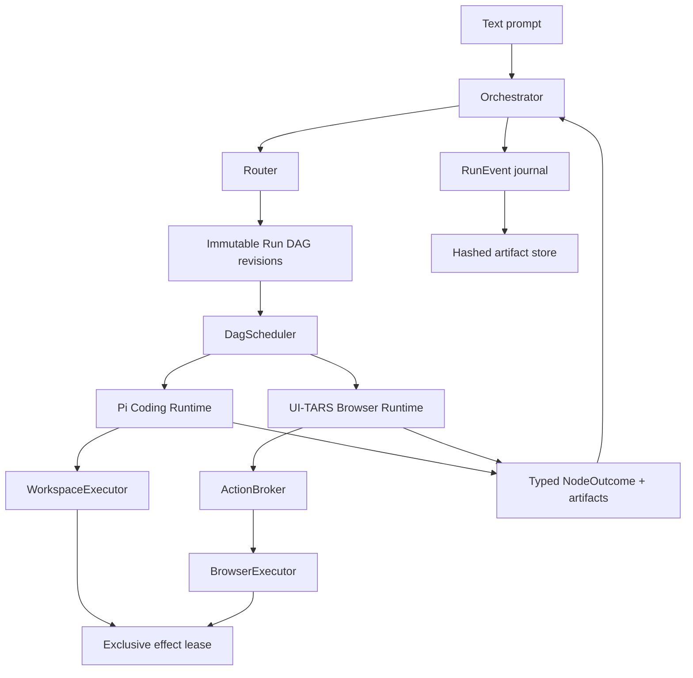
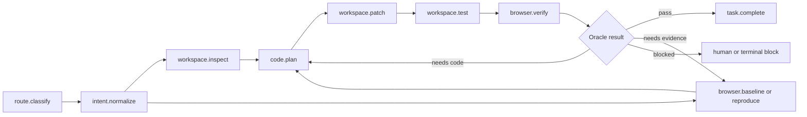

# PROTOTYPE — Prism developer-ready architecture

Status: `candidate for human review`  
Purpose: replace the superseded console-operations roadmap and I1–I8 graph  
Implementation status: `not started`

## Product boundary

Prism is a standalone TypeScript product. A text prompt is classified by an
Orchestrator, which expands an immutable, versioned Run DAG and coordinates two
embedded sibling runtimes:

- the Pi Agent SDK Coding Runtime inspects the repository, proposes and applies
  scoped source changes through a confined WorkspaceExecutor, and runs tests;
- the UI-TARS SDK Browser Runtime reproduces and localizes frontend defects,
  proposes typed browser actions through an ActionBroker, and verifies the
  rendered or interactive result.

The first release repairs objectively verifiable React interaction, state,
visibility, responsive-layout, occlusion, and directional-style defects. It
does not provide open-ended aesthetic design, authenticated third-party
dashboard mutation, a host-agent plugin, Python or remote workers, or a
general-purpose desktop-control surface.

## Architecture



Only the Orchestrator may append a DAG revision. Runtime prose cannot add
tools, widen authority, or switch runtimes. Read-only nodes may run in
parallel; source and browser effects share one fenced exclusive lease.

## Proposed workspace

```text
apps/
  cli/
packages/
  contracts/
  orchestrator/
  runtime-pi/
  runtime-ui-tars/
  workspace-executor/
  action-broker/
  trajectory-store/
  eval/
fixtures/
  react-repair/
```

The package seams are process-neutral interfaces even though the MVP runs in
one Node.js process. pnpm packages modularize Prism; they are not host-agent
plugins.

## Canonical contracts

- `RouterDecision`: `coding | browser | hybrid | uncertain`, confidence,
  capabilities, initial authority, and initial DAG revision.
- `FrontendRepairSpec`: original prompt plus exact, relational,
  event-to-state, and invariant acceptance predicates.
- `RunDagRevision` and versioned node registry: typed input/output, runtime,
  effect class, approval policy, timeout, retry bound, and legal successors.
- `RuntimeTaskEnvelope`: run, DAG, node and attempt IDs; runtime; artifact and
  baseline references; authority; budgets; deadline; cancellation,
  correlation, causation, and idempotency keys.
- `NodeOutcome`: the closed outcome vocabulary accepted by the Orchestrator.
- `BrowserObservation`: build, page, viewport, target, screenshot, DOM,
  accessibility, computed-style, geometry, console, and network evidence.
- `BrowserVerificationReport`: `passed | failed | inconclusive`, assertions,
  observation and artifact references, limitations, and redactions.
- `RunManifest`, `RunEvent`, `ArtifactRef`, and derived `RunSnapshot`.

## Nominal hybrid flow



Retries append bounded attempt nodes; they do not create graph cycles. The
Orchestrator may choose a different defensible read ordering, but every
approved scenario requires a pre-mutation baseline or reproduction and a final
browser verification.

## Persistence and recovery

The append-only `RunEvent` journal is the source of truth. Hashed artifacts
store screenshots, traces, patches, tests, and reports. `RunSnapshot` is a
rebuildable projection.

After process restart, Prism restores the last committed node boundary. It
does not continue from a partial model output or browser input, undo the prior
node, or rewind the DAG. A read-only node receives a new bounded attempt. An
unknown effect is reconciled against workspace or browser reality before it
can be retried. Partial or unknowable effects append a recovery or compensation
node or block for human review. Persisted fencing tokens prevent stale
executors from committing after recovery.

## Authority and safety

| Capability | Coding Runtime | Browser Runtime |
| --- | --- | --- |
| Repository read | Through scoped workspace tools | Never |
| Repository write or patch | Through WorkspaceExecutor | Never |
| Shell and tests | Allowlisted through WorkspaceExecutor | Never |
| Screenshot and page evidence | Artifact references only | Yes |
| Browser input | Never directly | Typed proposal through ActionBroker |
| DAG mutation | Never | Never |
| Run artifacts | Typed references | Broker-owned artifacts only |

Local observations and ephemeral interactions inside the allowlisted fixture
may run automatically. Cross-origin movement, secrets, file transfer,
persistent external writes, destructive actions, and permission changes
require approval or are denied.

## Approved React suite

1. Make the primary Save button clearly rounded instead of square.
2. Restore a visible card shadow without moving its layout.
3. Repair an Edit profile button that does not open its dialog.
4. Repair Submit remaining disabled after a valid email.
5. Repair mobile checkout actions overflowing the viewport.
6. Repair an account menu hidden behind the header.

The first two are directional change requests; the remaining four are
reproducible bugs. Every scenario has a known-bad revision, deterministic
reset, scoped code oracle, and authoritative browser oracle.

## Evaluation gates

- Coding non-regression: 12 frozen SWE-bench Verified tasks, direct Pi versus
  embedded Pi, one paired attempt each. Embedded Pi may resolve at most one
  fewer task and may add no containment or cleanup failure.
- Prism capability: six scenarios times three attempts. Require at least two
  successes per scenario and at least 15 of 18 overall.
- Route and safety: structurally valid DAGs and zero forbidden effects.
- Replay: schemas and hashes validate and reconstruct the same terminal state.
- Resources: manifest caps are hard; report median and p95 tokens, cost, and
  wall time without skipping browser verification.
- Cadence: deterministic tests on every change, one optional pre-merge model
  smoke, and the full 42-attempt suite only for release candidates or a
  scheduled run.

## Candidate implementation DAG

| ID | Deliverable | Blocked by | Milestone |
| --- | --- | --- | --- |
| R1 | Scaffold pnpm workspace and versioned contracts | — | M1 |
| R2 | Event journal, artifact store, and run projection | R1 | M1 |
| R3 | Confined WorkspaceExecutor | R1 | M1 |
| R4 | ActionBroker and BrowserExecutor | R1 | M1 |
| R5 | Orchestrator, DagScheduler, and fenced effect lease | R1, R2 | M1 |
| R6 | Pi Agent SDK Coding Runtime | R1, R3 | M1 |
| R7 | UI-TARS Browser Runtime | R1, R4 | M1 |
| R8 | Deterministic React fixture and browser oracles | R1 | M1 |
| R9 | Round-button end-to-end vertical slice | R5, R6, R7, R8 | M1 |
| R10 | Safety, cancellation, and recovery fault suite | R2, R5, R9 | M2 |
| R11 | Remaining five React repair scenarios | R9 | M2 |
| R12 | Eval runner and frozen SWE-bench manifest | R10, R11 | M2 |
| R13 | CLI packaging and release evidence | R12 | M2 |

## Proposed first milestone

M1 ends at R9. It is accepted only when one natural-language round-button
request completes through the real embedded Pi and UI-TARS runtimes:

1. Prism records the prompt and normalized relational repair spec.
2. Browser Runtime captures the pre-mutation rendered baseline.
3. Coding Runtime produces a scoped patch through WorkspaceExecutor.
4. The fixture builds and relevant tests pass.
5. Browser Runtime proves the radius increased materially while invariants
   remain true.
6. The journal and artifacts reconstruct the same terminal result.
7. One injected process restart after the committed baseline resumes from the
   node boundary and completes without repeating a committed node.
8. The Browser Runtime cannot write source, and both executor paths honor the
   fenced effect lease.

M1 deliberately excludes the other five scenarios, the full fault matrix, the
frozen SWE-bench manifest, the 42-attempt release evaluation, and polished CLI
packaging. Those remain M2 work built on a proven vertical seam.

## Review question

Is M1 the right boundary, or should any of R10–R13 move into the first
milestone before implementation begins?
